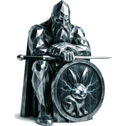
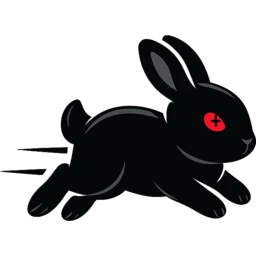
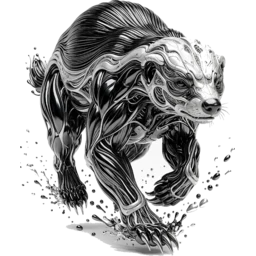
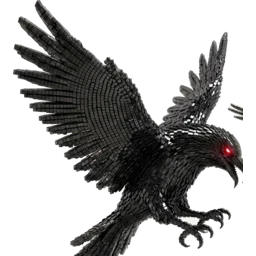

# Ignalina ApS

*"We love the smell of motherboards in the morning"* — og vi laver udelukkende premium-software.
Vi er en rent skandinavisk virksomhed.
Vores applikationer leveres som open source, som SaaS og som hardware-appliances.

**Vores SaaS-løsninger kører på finsk atomkraft.**

## Produkter

 **[holger](https://codeberg.org/nordisk/holger)** — immutable artifact repository i ren Rust.
Spejler fra internettet, Nexus eller Artifactory til uforanderlige znippy-arkiver til air-gapped miljøer:
content-addressed med Blake3, O(1) random access til filer, 2 MB RSS.

 **[znippy](https://codeberg.org/nordisk/znippy)** — parallelt arkiv med random access, bygget på Apache Arrow IPC.
Pakker en mappe med fuld fart på alle kerner og henter en enkelt fil ud uden at pakke resten ud;
indekset kan forespørges direkte fra DuckDB, Polars eller DataFusion.

 **[gunnar](https://gunnar.rs)** — Git-server i Rust på Apache Arrow.
To motorer: znippy (Arrow IPC på én maskine eller en fuld Apache Iceberg-klynge) eller gix på et almindeligt filsystem.
Indbygget geo-replikering til en twin; gratis at hoste selv, eller hostet på gunnar.rs.

 **[skade](https://codeberg.org/nordisk/skade)** — Apache Iceberg i ren Rust.
Kataloget hviler på et statisk søgetræ med opslag på nanosekunder og kan indlejres in-process som én fil;
katalog-læsninger målt til 492× Nessie og 677× Polaris. SQL via DataFusion.

 **korp** — én robot-testbar egui-app over hele datavejen.
Hugin holder øje med nuet: Spark-pipelines, en live FalkorDB-graf, ingest. Munin bærer hukommelsen:
Iceberg time-travel, kort, efterforskninger. Leveres som en bootbar appliance.

 **tunnr** — framework til bare-metal appliances.
Minimale, distroless OS-images, hvor en Rust-binær kører som PID 1, network-first:
WireGuard-tunnelen er oppe før nogen anden pakke, i en VM eller på rigtig hardware.

Kontakt: [rickard@ignalina.dk](mailto:rickard@ignalina.dk)
